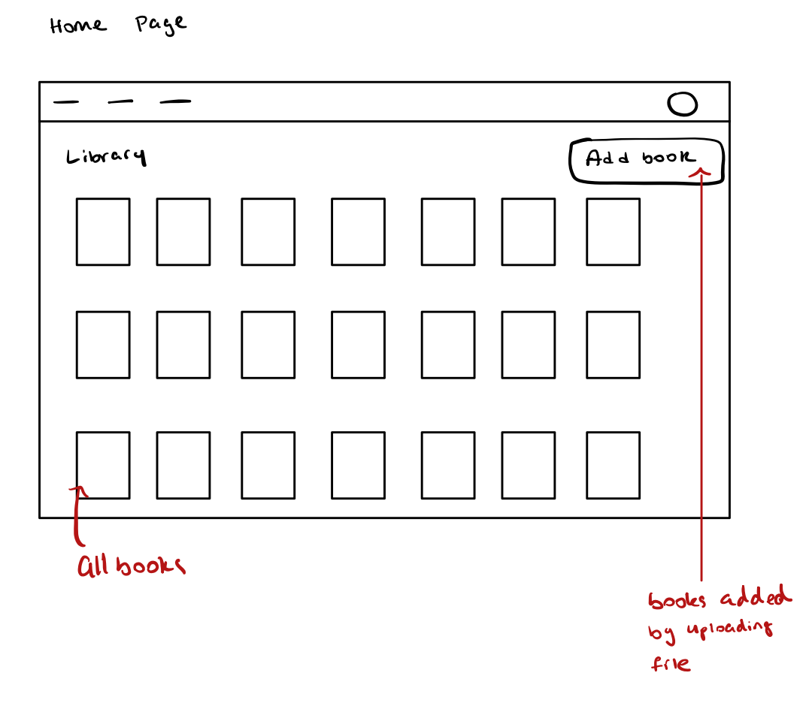
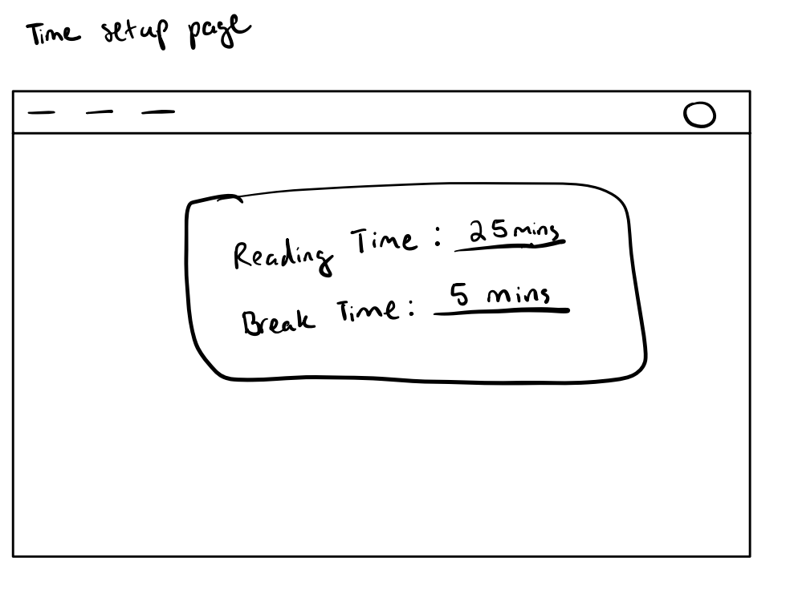
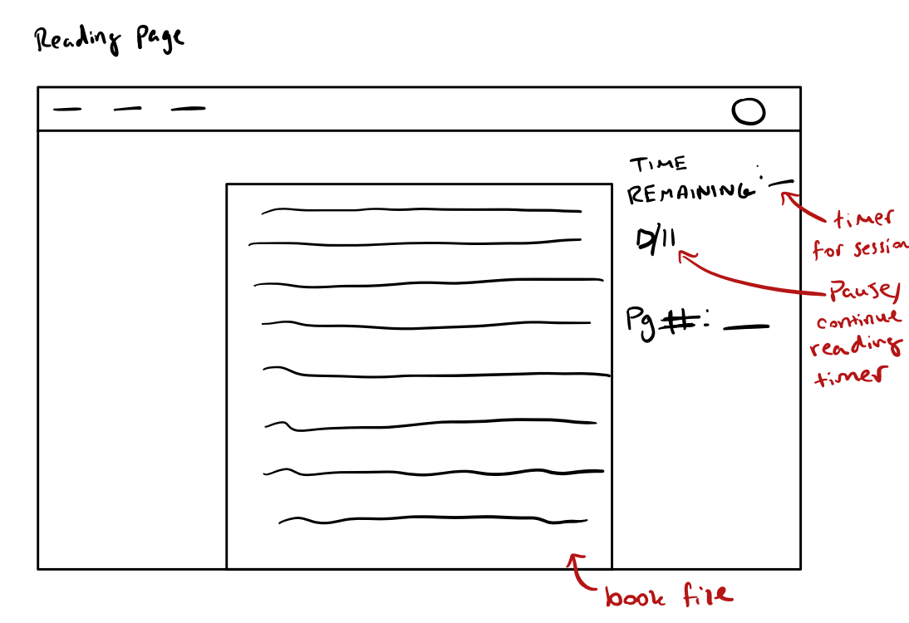
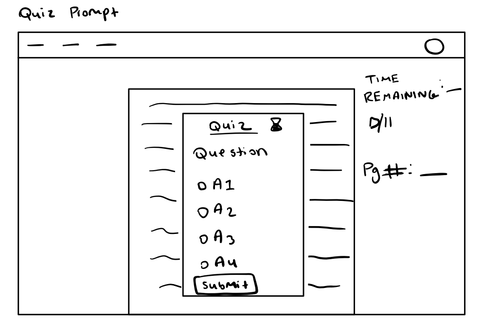
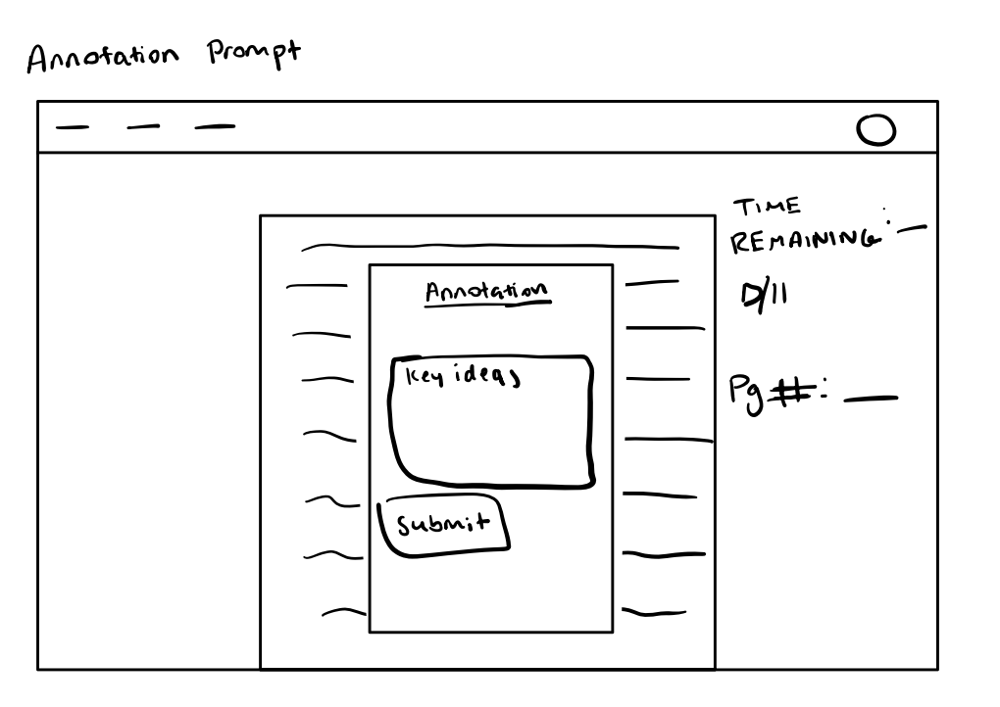
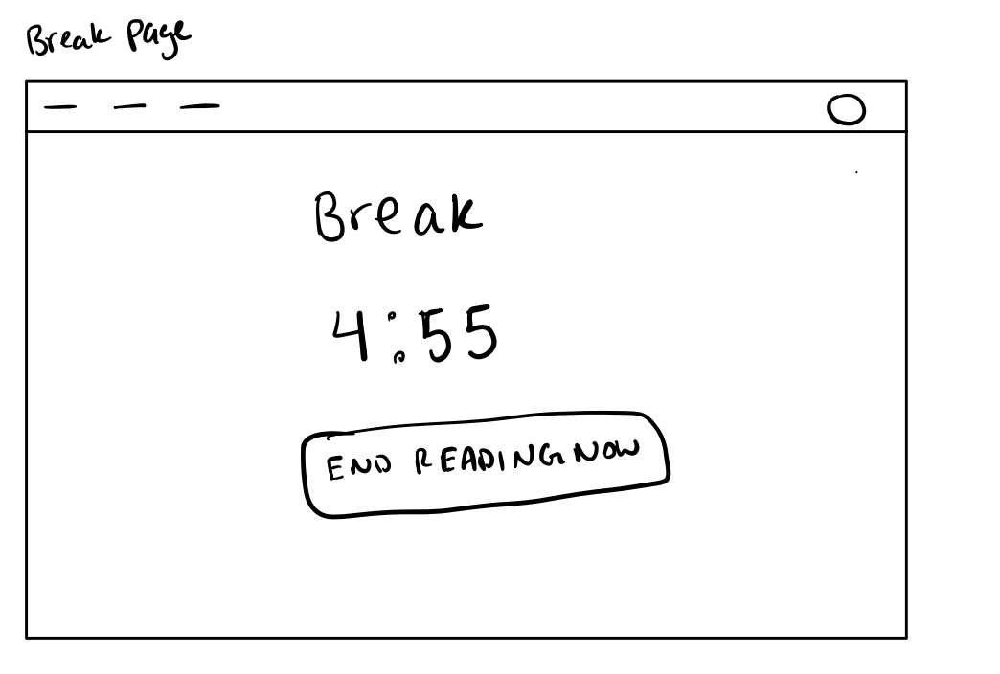

# Assignment 2

## Problem Statement

**Reading**

Reading is a great habit to take on that helps you intellectually. I don’t particularly enjoy reading, but I know that it’s good for me and has always helped me progress far in life during the periods when I read frequently. I enjoy reading about entrepreneurship, business skills, marketing, and books that will have a direct impact on my life for the better. I try my best to read 1 book per month.

**Distracted when reading**

Unfortunately, many people experience the same issue of getting distracted when reading and hate having to reread. This can be frustrating and demotivating. I want to find a solution that will help readers read actively instead of passively so we can stay focused and engaged.

**Stakeholders**

Reader (the user reading the book and engaging with the app)

Publisher/Author (entity that published the book and/or wrote the book)

Partner (someone who is reading the same book as Reader whether for a class, book club, or just for fun)

**Evidence**

[Getting Distracted While Reading](https://www.reddit.com/r/books/comments/22drro/getting_distracted_while_reading/): A reddit forum confirming that many people experience the same issue of getting distracted when reading and hate having to reread.

[Who doesn’t read books in America?](https://www.pewresearch.org/short-reads/2021/09/21/who-doesnt-read-books-in-america/?utm_source=chatgpt.com): Survey by Pew Research Center that show 26% of Americans did not read a single book in the past year, with distraction cited as one major barrier.

[What breaks the flow of reading? A study on characteristics of attentional disruption during digital reading](https://pmc.ncbi.nlm.nih.gov/articles/PMC9597324/): A 2022 study found that readers in a natural digital environment experienced attentional disruptions about every 4 minutes. Interestingly, media-unrelated interruptions were linked to better comprehension, while media-related ones were more common among heavy multitaskers.

[Freedom](https://freedom.to/): App that blocks distracting apps/sites but doesn’t make reading itself active.

[Bookly](https://getbookly.com/): App that helps you read as a daily habit and tracks your reading progress. It seems to be more for readers who are trying to make it a goal of reading daily and tracking that progress, rather than readers who are trying to understand their books the first time around.

## Application Pitch

### QuizRead

**Motivation**

QuizRead will stop readers from getting distracted when reading by giving a short quiz every 2 pages.

**Features**

**Checkpoint Quizzes:** After every 2 pages, the app auto-generates a quick multiple-choice question to test recall, keeping the reader engaged. If the reader is able to successfully answer this question, they know that they have been reading actively. Since the quizzes come up so often, the reader is forced into focusing so they absorb as much information as they can to get the quiz question correct. If the reader has a partner, the partner will appreciate the reader’s active engagement with the book, as they will be able to have better discussions about the book.

**Active Annotation Prompts:** The app occasionally prompts the reader to jot down key ideas, encouraging deeper processing. This helps the reader treat reading as an active activity rather than a passive one. Jotting down key ideas frequently can help the reader make connections between content across multiple pages. This moment of reflection allows the publisher/author to get readers who have a fairer review of their book and can provide a good judgment or feedback on it.

**Focus Mode Timer:** A Pomodoro-like timer that locks the reader into timed reading sessions, reducing external distractions. A major problem with distracted reading is that readers read for long periods of time while distracted, missing out on key pieces of information spanning multiple pages. The timer allows the reader to take short breaks and recap what happened during the latest session of their reading. If they were distracted, the effects are not as bad, as they can simply reread the section with more attention in their next focus session, or use the break to reflect and gather key information about what they just “read.”

## Concept Design

```
concept CheckpointQuiz [User, Content]
purpose quiz the reader on recently read content to maintain attention
principle after reading 2 pages, a multiple-choice quiz tests comprehension and feedback

state
  a set of Quizzes with
    a content Content
    a question String
    a set of answers String
    a correctAnswer String

  a set of QuizAttempts with
    a user User
    a quiz Quiz
    a selectedAnswer String
    a isCorrect Boolean

actions
  createQuiz (content: Content) : (quiz: Quiz)
    effect creates a quiz with a question and multiple-choice answers

  submitQuizAnswer (user: User, quiz: Quiz, answer: String) : (attempt: QuizAttempt)
    effect records user’s answer and whether it was correct

**Note**: The quiz questions will be generated using an AI model that takes in the content of the 2 pages and generates a relevant question with multiple-choice answers.

concept Annotate [User, Content]
purpose encourage active reading through reflection prompts
principle after the reader reads 3 pages, a text box pops up asking the reader to jot down key ideas they just read about

state
  a set of Annotations with
    a user User
    a content Content
    a keyIdeas String
    a timestamp DateTime

actions
  promptAnnotation (user: User, content: Content)
    effect displays a prompt for the user to annotate current content

  saveAnnotation (user: User, content: Content, ideas: String) : (annotation: Annotation)
    requires ideas is not empty
    effect creates and stores the annotation with the user’s key ideas


concept FocusTimer [User]
purpose set a timer for reading so reader takes frequent breaks
principle when the reader starts reading, a timer will start. after the reader reads for a specified amount of time, the timer will go off and a break timer will start for the user to take a break.

state
  a set of Timers with
    a user User
    a readingDuration Number
    a breakDuration Number
    a currentPhrase String // “reading” or “break”
    a timeRemaining Number
    a isActive Boolean

actions
  startReadingSession (user: User, readingTime: Number, breakTime: Number) : (timer: Timer)
    effect creates and starts a new timer for the user

  pauseTimer (user: User, timer: Timer)
    effect pauses the active Timer

  system expireTimer (timer: Timer)
    requires timer.timeRemaining <= 0 and timer.isActive
    effect switches timer.currentPhase (reading->break or break->reading) and resets the timer


concept ReadingProgress [User, Book]
purpose track the user’s reading position and trigger active reading engagement features
principle as users read through the book, the system tracks their progress and determines when to prompt quizzes, annotations, and breaks

state
  a set of ReadingSessions with
    a user User
    a content Content
    a currentPage Number
    a totalPages Number
    a pagesReadInSession Number
    a lastQuizPage Number
    a lastAnnotationPage Number
    a quizInterval Number // pages between quizzes
    a annotationInterval Number // pages between annotation prompts
    a startTime DateTime
    a totalReadingTime Number // in minutes
    a isActive Boolean

actions
  initializeProgress (user: User, content: Content, totalPages: Number, quizInterval: Number, annotationInterval: Number) : (session: ReadingSession)
    effect creates a new reading session starting at page 1 with set intervals for quizzes and annotations

  updateProgress (user: User, content: Content, session: ReadingSession, newPage: Number) : (session: ReadingSession)
    requires session exists for user and newPage > session.currentPage
    effect updates currentPage to be newPage and increments pagesReadInSession

  triggerQuiz (user: User, content: Content, session: ReadingSession): (trigger: Boolean)
    requires session exists for user and content
    effects returns T/F results of currentPage - lastQuizPage >= quizInterval

  promptAnnotation (user: User, content: Content, session: ReadingSession): (trigger: Boolean)
    requires session exists for user and content
    effects returns T/F results of currentPage - lastAnnotationPage >= annotationInterval

  recordQuizTriggered (user: User, session: ReadingSession, content: Content)
    requires session exists for user and content
    effect sets lastQuizPage = currentPage

  recordAnnotationTriggered (user: User, session: ReadingSession, content: Content)
    requires session exists for user and content
    effect sets lastAnnotationPage = currentPage

  pauseReading (user: User, session: ReadingSession, content: Content)
    requires session exists and isActive = true
    effect sets isActive = false, updates totalReadingTime

  resumeReading (user: User, session: ReadingSession, content: Content)
    requires session exists and isActive = false
    effect sets isActive = true, updates startTime


sync startReading
when Request.startReadingSession (user, readingTime, breakTime)
then
  ReadingProgress.initializeProgress (user, content, totalPages, quizInterval, annotationInterval)
  FocusTimer.startReadingSession (user, readingTime, breakTime)

sync triggerQuiz
when
  ReadingProgress.updateProgress (user, content)
  ReadingProgress.triggerQuiz(user, content) == True
then CheckpointQuiz.createQuiz (content)

sync submitQuizAnswer
when
  Request.submitQuizAnswer (user, quiz, answer)
then ReadingProgress.recordQuizTriggered (user, session, book)

sync promptAnnotation
when
  ReadingProgress.updateProgress (user, book)
  ReadingProgress.promptAnnotation (user, book) == True
then Annotate.promptAnnotation (user, content)

sync timerPhaseChange
when FocusTimer.expireTimer (session)
then ReadingProgress.pauseReading (user)

```

**Concept Roles and Integration**

The QuizRead app centers around ReadingProgress as the orchestrating concept that tracks user progress through books and determines when to trigger engagement features. This concept serves as the central coordinator, monitoring page-by-page progress and calculating when users have read enough content to prompt a quiz or an annotation.

CheckpointQuiz operates independently to generate and evaluate comprehension questions, but relies on ReadingProgress to know when to activate. The generic type parameters are instantiated with User representing individual readers and Content representing the specific book sections that have been read since the last quiz.

Annotate functions similarly, prompting users for reflection without knowing the broader reading context. It receives triggers from ReadingProgress when annotation intervals are reached. The Content parameter represents the same book sections as in CheckpointQuiz, ensuring consistency across engagement features.

FocusTimer operates independently from the content-aware concepts, managing reading sessions and break periods based on time intervals. It coordinates with ReadingProgress through synchronizations to pause progress tracking during breaks, but doesn't need to understand book content or user comprehension.

## UI Sketches








## User journey

A user is trying to read their book for a class assignment. Unfortunately, they get distracted when reading and often have to reread pages multiple times, wasting time and effort.

They search for ways to maintain their focus while reading and discover the concept of active reading. They find our app, QuizRead, and log in. They see the option to upload a digital version of their book, so they do so. They are prompted with some form fields as to how long they want their timed reading sessions and breaks to be, with the recommended choices of 25 minutes of reading time and 5 minutes of break time already filled out.

As they’re reading, they can see a time tracker of when their session will be over as well as a pause and play button if they need to stop reading during the session for some reason. After reading every 2 pages, a quiz comes up about those pages. The user has to select one of the four answers, and after submitting, they receive feedback about their answer.

After reading every 3 pages, an annotation prompt comes up asking the user to write down key ideas they just read about. Once the user is done typing their annotation, they can click submit, and the annotation will be saved.

Once the timer for the user’s current session runs out, they’ll be taken to a break page where a timer will show how long they have for their break. If the user feels as if they’re done reading now, they can also exit to the home page.
